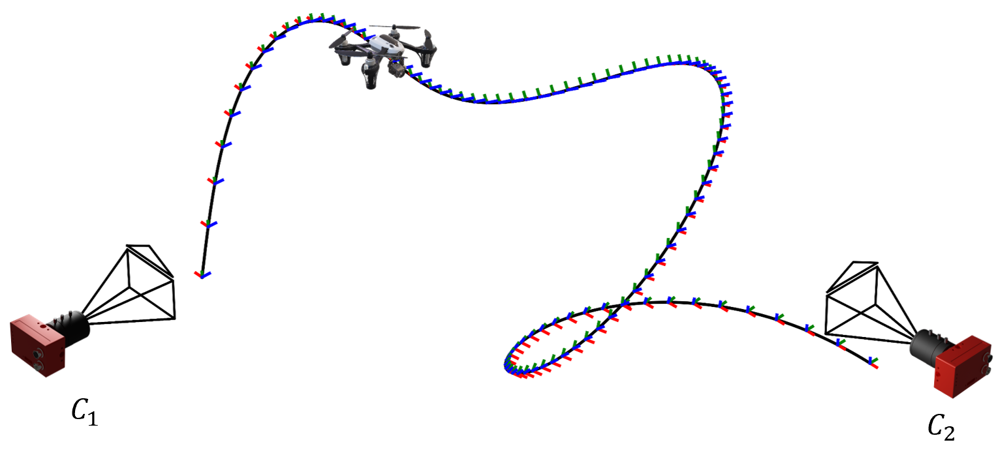
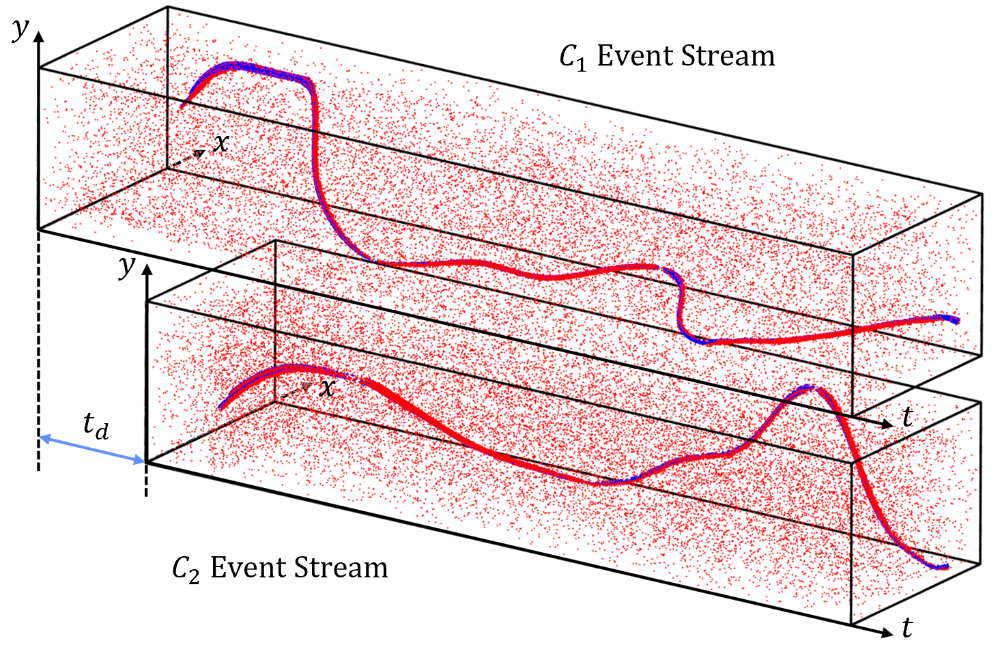

# Simultaneous Synchronization and Calibration for Wide-baseline Stereo Event Cameras
## ICRA2024 Paper Submission

This repository hosts the codebase and dataset for our research paper, "Simultaneous Synchronization and Calibration for Wide-baseline Stereo Event Cameras," currently under review for ICRA2024.

## Abstract
Event-based cameras offer remarkable advantages such as high temporal resolution and low power consumption but suffer from synchronization issues when deployed in multi-camera settings. Our paper introduces a software-based method to achieve millisecond-level synchronization while simultaneously estimating extrinsic parameters. Our approach eliminates the need for specialized hardware, thus making it particularly suitable for wide-baseline configurations. The robustness and applicability of our method are empirically demonstrated through extensive simulations and real-world experiments.
&nbsp;

<div align="center">
    <div align="center">
        
    </div>
    <div style="color: gray; font-size: 10px;">
        Illustration of dual-perspective event capture
    </div>
</div>
&nbsp;

<div align="center">
    <div align="center">
        
    </div>
    <div style="color: gray; font-size: 10px;">
        Temporal misalignment
    </div>
</div>
&nbsp;

## Usage

To get started, follow the step-by-step instructions below:

1. **Dataset Download**: 
   - Begin by downloading our datasets from our provided [OneDrive link](https://connecthkuhk-my.sharepoint.com/:u:/g/personal/wlxing_connect_hku_hk/EVSg1mM93ptEm1NTZR-gA1oBr73tjPyWf4QpF-k6uqQfGQ?e=czs80b). 
   - Additionally, if you wish to simulate more data yourself, you can leverage the configurations we provide and use the ESIM tool, available at [ESIM's GitHub Repository](https://github.com/uzh-rpg/rpg_esim).

2. **Environment Setup**:
   - Navigate to the `./config` directory where you can find the `ssac.yaml` file.
   - Use this yaml file to create a conda environment by running:
     ```
     conda env create -f ssac.yaml
     ```
   - Activate the newly created environment:
     ```
     conda activate <environment_name>
     ```

3. **MATLAB Engine API Setup**:
    - Locate your MATLAB root directory. Once located, navigate to the external engines python directory by running:
        ```
        cd "matlabroot/extern/engines/python"
        ```
    - Inside this directory, set up the MATLAB Engine API by executing:
        ```
        python setup.py install
        ```

4. **Running the Code**:
   - Navigate to the `./src` directory.
   - To execute the main script, run:
     ```
     python esim_ssac.py
     ```
   - The configuration settings within the script can be easily modified to suit your needs or to experiment with different parameters.


## Results
The robustness of our proposed synchronization approach is empirically substantiated through extensive evaluations, including both simulation-based benchmarks and real-world experimental validations.
&nbsp;

<div align="center">
    <div align="center">
        
    </div>
    <div style="color: gray; font-size: 10px;">
        Unsynchronized event streams and F matrix
    </div>
</div>
&nbsp;

<div align="center">
    <div align="center">
        
    </div>
    <div style="color: gray; font-size: 10px;">
        Synchronized event streams and F matrix
    </div>
</div>

## Contributions
- Novel software-based approach for temporal synchronization of event-based cameras in wide-baseline settings.
- Simultaneous estimation of extrinsic parameters, thus integrating these processes for increased efficiency.
- Comprehensive validation of the method through simulations and real-world experiments.

## Contact

For further inquiries or questions, please contact us at [wlxing@connect.hku.hk].

Thank you for your interest in our research.

